# 智能体通用入口组件 (Agent Component)

跨框架的通用智能体入口组件，支持 **Vue 2**, **Vue 3**, **React**。

## 安装

```bash
# Vue 3
npm install @gray0128/agent-component-vue3

# Vue 2
npm install @gray0128/agent-component-vue2

# React
npm install @gray0128/agent-component-react
```

## 使用示例

### Vue 3
```html
<script setup>
import { AgentComponent } from '@gray0128/agent-component-vue3';

const agents = [
  { title: '智维百事通', url: 'http://example.com/chat/1' },
  { title: '设备诊断专家', url: 'http://example.com/chat/2' }
];

const handleSelect = (agent) => {
  window.open(agent.url, '_blank');
};
</script>

<template>
  <AgentComponent 
    :agents="agents" 
    apiUrl="http://api.example.com/agents"
    :autoHide="true"
    storageKey="my-app-agent-closed"
    phone="400-000-1111"
    iconType="emoji"
    icon="🚀"
    triggerText="智能助理"
    triggerStyle="background: linear-gradient(135deg, #f093fb 0%, #f5576c 100%);"
    @agent-selected="handleSelect"
  />
</template>
```

### React
```jsx
import { AgentComponent } from '@gray0128/agent-component-react';

function App() {
  const agents = [
    { title: '智维百事通', url: 'http://example.com/chat/1' }
  ];
  
  return (
    <AgentComponent 
      agents={agents} 
      apiUrl="http://api.example.com/agents"
      autoHide={true}
      storageKey="my-app-agent-closed"
      phone="400-000-1111"
      iconType="image"
      icon="https://example.com/icon.png"
      triggerText="AI助手"
      onAgentSelected={(agent) => window.open(agent.url)}
    />
  );
}
```

## API


### 属性

| 属性 | 类型 | 默认值 | 说明 |
|-----|------|-------|-----|
| `agents` | `Agent[]` | `[]` | 智能体列表 |
| `apiUrl` | `string` | `''` | 接口地址 |
| `phone` | `string` | `'400-XXX-XXXX'` | 客服电话 |
| `triggerText` | `string` | `'AI助手'` | 触发器文字 |
| `iconType` | `'emoji' \| 'image' \| 'font' \| 'none'` | `'emoji'` | 图标类型 |
| `icon` | `string` | `'🤖'` | 图标内容（emoji 字符、图片 URL 或 font icon 类名） |
| `triggerStyle` | `string` | `''` | 触发器自定义样式（CSS 字符串） |
| `autoHide` | `boolean` | `false` | 无数据时是否自动隐藏 |
| `storageKey` | `string` | `'agent-component-hidden-date'` | 手动关闭状态的存储 Key，用于隔离不同应用 |
| `confirmText` | `string` | `'确定要关闭助手吗？...'`| 关闭时的确认提示文本 |

**关于 `autoHide` 的说明**：
当设置为 `true` 时：
1. **自动隐藏**：如果 `agents` 属性为空且 API 返回的数据也为空，组件将完全隐藏 (`display: none`)。
2. **立即加载**：组件挂载时会立即调用 `apiUrl` 获取数据（Eager Fetch），以确定是否需要显示。默认行为（`false`）是鼠标悬停时才请求数据。

**Agent 类型**：
```typescript
interface Agent {
  title: string;      // 名称
  url: string;        // 跳转URL
  avatar?: string;    // 可选头像
  description?: string;
}
```

### 事件

| Vue 事件 | React 事件 | 说明 |
|---------|-----------|-----|
| `agent-selected` | `onAgentSelected` | 点击智能体，回调参数: `(agent: Agent)` |
| `component-closed` | `onComponentClosed` | 点击关闭，无参数 |

## 样式定制

```css
:root {
  --agent-panel-width: 240px;
  --agent-footer-bg: #fafafa;
  --agent-phone-color: #667eea;
  
  /* 确认弹窗样式 */
  --agent-confirm-bg: #fff;
  --agent-confirm-text: #333;
}
```

## 行为逻辑 (Logic Flow)

下方流程图展示了组件从初始化到显示的完整判断逻辑，以及交互过程：

```mermaid
flowchart TD
    Start["组件挂载"] --> CheckStorage{"检查手动关闭记录<br/>(storageKey)"}
    CheckStorage -- 今日已关闭 --> Hidden["隐藏组件"]
    CheckStorage -- 无记录/已过期 --> CheckAutoHide{"开启 autoHide?"}
    
    CheckAutoHide -- Yes --> CheckApi{"有 apiUrl?"}
    CheckApi -- "Yes (Eager Fetch)" --> FetchData["立即请求数据"]
    FetchData --> CheckData{"有数据?"}
    CheckData -- No --> Hidden
    CheckData -- Yes --> Visible["显示组件"]
    CheckApi -- No --> CheckProps{"props.agents 有数据?"}
    CheckProps -- No --> Hidden
    CheckProps -- Yes --> Visible
    
    CheckAutoHide -- No --> Visible
    
    Visible --> UserHover["鼠标悬停"]
    UserHover --> CheckApiHover{"有 apiUrl?"}
    CheckApiHover -- Yes --> FetchDataHover["请求最新数据 (Refetch)"] --> ShowPanel["显示面板"]
    CheckApiHover -- No --> ShowPanel

    Visible --> UserClose["点击关闭"] --> Confirm{"确认关闭?"}
    Confirm -- Yes --> SaveStorage["写入 localStorage"] --> Hidden
    Confirm -- No --> Visible
```

